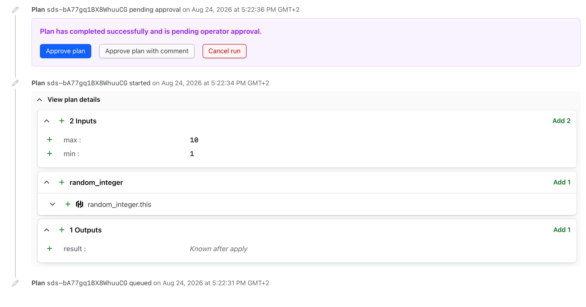
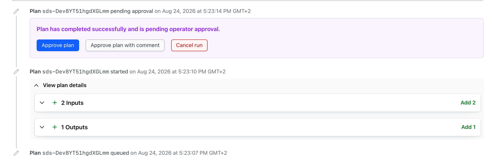
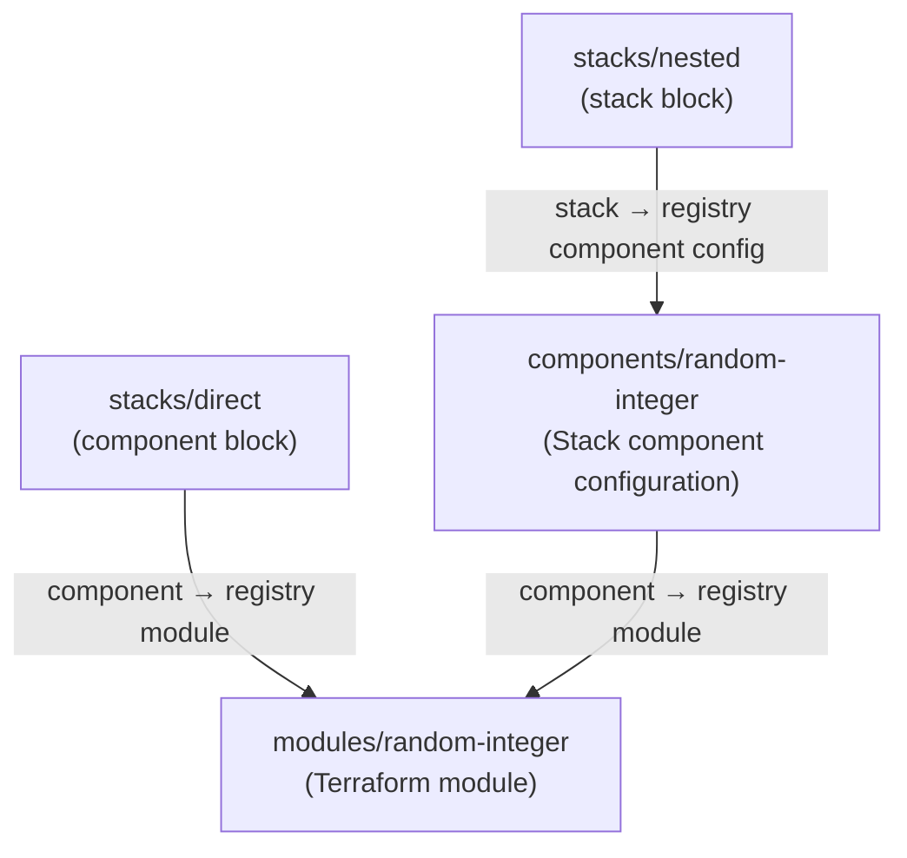

# Terraform Stacks (possible bug) demo

A small example setup to illustrate that the **plan output** is different depending on how you consume a module.

* [Consuming a module directly as a component](#consuming-a-module-directly-as-a-component) - in this case the plan output shows: inputs, resource changes, and outputs.
* [Consuming a component configuration as a stack which in turn consumes the module directly](#consuming-a-component-configuration-as-a-stack-which-in-turn-consumes-the-module-directly) - in this case the plan output shows: inputs and outputs. **Resource changes are absent**, and **there is no way to get this information before you go on to apply**.

## Consuming a module directly as a component

Consuming a **module** directly in a `component` block from a stack, e.g.:

```hcl
component "random_integer" {
  source  = "app.terraform.io/MY-ORG-NAME/random-integer/random"
  version = "~> 1.0"

  inputs = {
    min = var.min
    max = var.max
  }

  providers = {
    random = provider.random.this
  }
}
```

When you run your stack the initial plan looks like this:



## Consuming a component configuration as a stack which in turn consumes the module directly

Consuming a **component configuration** in a `stack` block, which in turn consumes the module in a `component` block. In the component configuration (exact same code as in the example above):

```hcl
component "random_integer" {
  source  = "app.terraform.io/MY-ORG-NAME/random-integer/random"
  version = "~> 1.0"

  inputs = {
    min = var.min
    max = var.max
  }

  providers = {
    random = provider.random.this
  }
}
```

In the consuming stack:

```hcl
stack "random_integer" {
  source  = "app.terraform.io/MY-ORG-NAME/random-integer"
  version = "~> 1.0"

  inputs = {
    min = var.min
    max = var.max
  }
}
```

When you run your stack the initial plan looks like this:



## Repository layout

```text
.
├── modules/
│   └── random-integer/       # Terraform module
├── components/
│   └── random-integer/       # Stack component configuration wrapping the module
└── stacks/
    ├── direct/               # Stack consuming the module directly (component block)
    └── nested/               # Stack consuming the component configuration (stack block)
```

## How the pieces relate



1. **`modules/random-integer`** is a plain Terraform module with `min` and `max`
   inputs and a `result` output. Publish it to your HCP Terraform private
   registry as `random-integer` with provider `random`.
2. **`components/random-integer`** is a Stack component configuration. It
   sources the registry module in a `component` block, declares its own
   `hashicorp/random` provider, and exposes the same `min`/`max`/`result`
   interface. Publish it to your private registry as a Stack component
   configuration named `random-integer`.
3. **`stacks/direct`** is a Stack that consumes the registry module directly
   through a `component` block. It has a single deployment named `dummy`.
4. **`stacks/nested`** is a Stack that consumes the published component
   configuration through a `stack` block. It has a single deployment named
   `default`.
