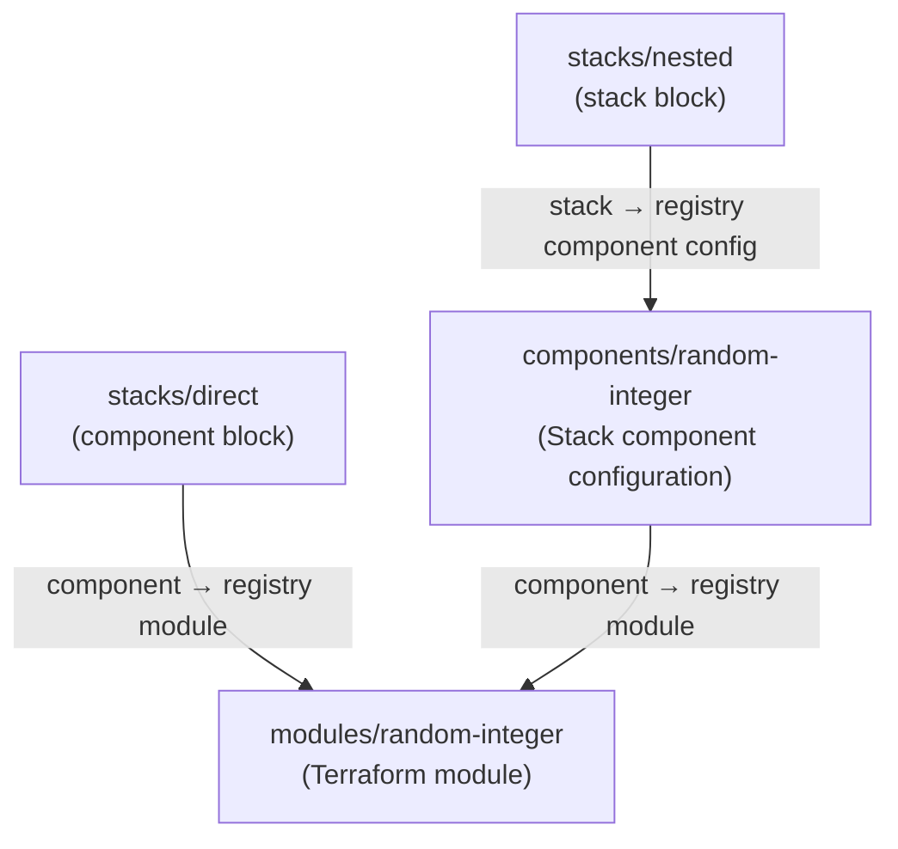

# Terraform Stacks demo

A monorepo demonstrating the Terraform Stacks composition pattern on HCP Terraform:
a Terraform module, a reusable Stack component configuration wrapping that module,
and two consuming Stacks — one sourcing the module directly in a `component` block,
and one sourcing the component configuration through a `stack` block.

## Repository layout

```text
.
├── modules/
│   └── random-integer/       # Terraform module (random_integer resource, min/max inputs)
├── components/
│   └── random-integer/       # Stack component configuration wrapping the module
└── stacks/
    ├── direct/               # Stack consuming the module directly (component block)
    │                         #   one deployment named "dummy"
    └── nested/               # Stack consuming the component configuration (stack block)
                              #   one deployment named "default"
```

## How the pieces relate



1. **`modules/random-integer`** is a plain Terraform module with `min` and `max`
   inputs and a `result` output. Publish it to your HCP Terraform private
   registry as `random-integer` with provider `random`.
2. **`components/random-integer`** is a Stack component configuration. It
   sources the registry module in a `component` block, declares its own
   `hashicorp/random` provider, and exposes the same `min`/`max`/`result`
   interface. Publish it to your private registry as a Stack component
   configuration named `random-integer`.
3. **`stacks/direct`** is a Stack that consumes the registry module directly
   through a `component` block. It has a single deployment named `dummy`.
4. **`stacks/nested`** is a Stack that consumes the published component
   configuration through a `stack` block. It has a single deployment named
   `default`.

## Prerequisites

- An HCP Terraform organization with access to Terraform Stacks and the
  private registry.
- Terraform CLI `>= 1.14` (for the `terraform stacks` commands).

> [!NOTE]
> Terraform Stacks requires a `.terraform-version` file alongside the root
> `.tfcomponent.hcl` files. Both stack directories and the component
> configuration pin `1.15.8` — adjust to the version you want HCP Terraform
> to use.

## Setup

1. Replace the `MY-ORG-NAME` placeholder with your HCP Terraform organization
   name everywhere in the repository:

   ```shell
   grep -rl 'MY-ORG-NAME' --include='*.hcl' --include='*.md' . | xargs sed -i '' 's/MY-ORG-NAME/your-org-name/g'
   ```

2. Publish `modules/random-integer` to your private module registry as
   `random-integer` for provider `random`, tagged `1.0.0`.
3. Publish `components/random-integer` to your private registry as a Stack
   component configuration named `random-integer`, version `1.0.0`.
4. Create two Stacks from this repository, pointing at the `stacks/direct` and
   `stacks/nested` directories respectively.

## Local validation

Both stack configurations can be validated locally once the registry artifacts
are published and you are logged in with `terraform login`:

```shell
cd stacks/direct
terraform stacks init
terraform stacks validate

cd ../nested
terraform stacks init
terraform stacks validate
```
